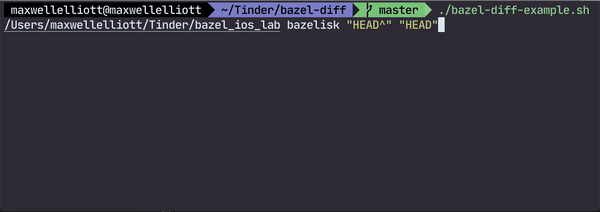

# bazel-diff

[](https://github.com/Tinder/bazel-diff/actions/workflows/ci.yaml)

`bazel-diff` is a command line tool for Bazel projects that allows users to determine the exact affected set of impacted targets between two Git revisions. Using this set, users can test or build the exact modified set of targets.

`bazel-diff` offers several key advantages over rolling your own target diffing solution

1. `bazel-diff` is designed for very large Bazel projects. We use Java Protobuf's `parseDelimitedFrom` method alongside Bazel Query's `streamed_proto` output option. These two together allow you to parse Gigabyte or larger protobuf messages. We have tested it with projects containing tens of thousands of targets.
2. We avoid usage of large command line query lists when interacting with Bazel, [issue here](https://github.com/bazelbuild/bazel/issues/8609). When you interact with Bazel with thousands of query parameters you can reach an upper maximum limit, seeing this error `bash: /usr/local/bin/bazel: Argument list too long`. `bazel-diff` is smart enough to avoid these errors.
3. `bazel-diff` has been tested with file renames, deletions, and modifications. Works on `bzl` files, `WORKSPACE` files, `BUILD` files and regular files

Track the feature request for target diffing in Bazel [here](https://github.com/bazelbuild/bazel/issues/7962)

This approach was inspired by the [following BazelConf talk](https://www.youtube.com/watch?v=9Dk7mtIm7_A) by Benjamin Peterson.

> There are simpler and faster ways to approximate the affected set of targets.
> However an incorrect solution can result in a system you can't trust,
> because tests could be broken at a commit where you didn't select to run them.
> Then you can't rely on green-to-red (or red-to-green) transitions and
> lose much of the value from your CI system as breakages can be discovered
> later on unrelated commits.

## Prerequisites

* Git
* Bazel 3.3.0 or higher
* Java 8 JDK or higher (Bazel requires this)

## Getting Started

To start using `bazel-diff` immediately, simply clone down the repo and then run the example shell script:

```terminal
git clone https://github.com/Tinder/bazel-diff.git
cd bazel-diff
./bazel-diff-example.sh WORKSPACE_PATH BAZEL_PATH START_GIT_REVISION END_GIT_REVISION
```

Here is a breakdown of those arguments:

* `WORKSPACE_PATH`: Path to directory containing your `WORKSPACE` file in your Bazel project.
* `BAZEL_PATH`: Path to your Bazel executable
* `START_GIT_REVISION`: Starting Git Branch or SHA for your desired commit range
* `END_GIT_REVISION`: Final Git Branch or SHA for your desired commit range

You can see the example shell script in action below:



Open `bazel-diff-example.sh` to see how this is implemented. This is purely an example use-case, but it is a great starting point to using `bazel-diff`.

## With Aspect CLI

Aspect's Extension Language (AXL) allows the shell script above to be expressed in Starlark, and exposed as an `impacted` command on your terminal.

See https://github.com/aspect-extensions/impacted

## How it works

`bazel-diff` works as follows

* The previous revision is checked out, then we run `generate-hashes`. This gives us the hashmap representation for the entire Bazel graph, then we write this JSON to a file.

* Next we checkout the initial revision, then we run `generate-hashes` and write that JSON to a file. Now we have our final hashmap representation for the Bazel graph.

* We run `bazel-diff` on the starting and final JSON hash filepaths to get our impacted set of targets. This impacted set of targets is written to a file.

## Build Graph Distance Metrics

`bazel-diff` can optionally compute build graph distance metrics between two revisions. This is
useful for understanding the impact of a change on the build graph. Directly impacted targets are
targets that have had their rule attributes or source file dependencies changed. Indirectly impacted
targets are that are impacted only due to a change in one of their target dependencies.

For each target, the following metrics are computed:

* `target_distance`: The number of dependency hops that it takes to get from an impacted target to a directly impacted target.
* `package_distance`: The number of dependency hops that cross a package boundary to get from an impacted target to a directly impacted target.

Build graph distance metrics can be used by downstream tools to power features such as:

* Only running sanitizers on impacted tests that are in the same package as a directly impacted target.
* Only running large-sized tests that are within a few package hops of a directly impacted target.
* Only running computationally expensive jobs when an impacted target is within a certain distance of a directly impacted target.

To enable this feature, you must generate a dependency mapping on your final revision when computing hashes, then pass it into the `get-impacted-targets` command.

```bash
git checkout BASE_REV
bazel-diff generate-hashes -w /path/to/workspace -b bazel starting_hashes.json

git checkout FINAL_REV
bazel-diff generate-hashes -w /path/to/workspace -b bazel --depEdgesFile deps.json final_hashes.json

bazel-diff get-impacted-targets -w /path/to/workspace -b bazel -sh starting_hashes.json -fh final_hashes.json --depEdgesFile deps.json -o impacted_targets.json
```

This will produce an impacted targets json list with target label, target distance, and package distance:

```text
[
  {"label": "//foo:bar", "targetDistance": 0, "packageDistance": 0},
  {"label": "//foo:baz", "targetDistance": 1, "packageDistance": 0},
  {"label": "//bar:qux", "targetDistance": 1, "packageDistance": 1}
]
```

<!-- BEGIN_SECTION: cli-help -->
## CLI Interface

`bazel-diff` Command

```terminal
Usage: bazel-diff [-hvV] [COMMAND]
Writes to a file the impacted targets between two Bazel graph JSON files
  -h, --help      Show this help message and exit.
  -v, --verbose   Display query string, missing files and elapsed time
  -V, --version   Print version information and exit.
Commands:
  generate-hashes       Writes to a file the SHA256 hashes for each Bazel
                          Target in the provided workspace.
  get-impacted-targets  Command-line utility to analyze the state of the bazel
                          build graph
```

### `generate-hashes` command

```terminal
Usage: bazel-diff generate-hashes [-hkvV] [--[no-]excludeExternalTargets] [--
                                  [no-]includeTargetType] [--[no-]useCquery]
                                  [-b=<bazelPath>]
                                  [--contentHashPath=<contentHashPath>]
                                  [--cqueryExpression=<cqueryExpression>]
                                  [-d=<depsMappingJSONPath>]
                                  [--fineGrainedHashExternalReposFile=<fineGrain
                                  edHashExternalReposFile>]
                                  [-m=<modifiedFilepaths>] [-s=<seedFilepaths>]
                                  -w=<workspacePath>
                                  [-co=<bazelCommandOptions>]...
                                  [--cqueryCommandOptions=<cqueryCommandOptions>
                                  ]...
                                  [--fineGrainedHashExternalRepos=<fineGrainedHa
                                  shExternalRepos>]...
                                  [--ignoredRuleHashingAttributes=<ignoredRuleHa
                                  shingAttributes>]...
                                  [-so=<bazelStartupOptions>]...
                                  [-tt=<targetType>[,<targetType>...]]...
                                  <outputPath>
Writes to a file the SHA256 hashes for each Bazel Target in the provided
workspace.
      <outputPath>        The filepath to write the resulting JSON of
                            dictionary target => SHA-256 values. If not
                            specified, the JSON will be written to STDOUT.
  -b, --bazelPath=<bazelPath>
                          Path to Bazel binary. If not specified, the Bazel
                            binary available in PATH will be used.
      -co, --bazelCommandOptions=<bazelCommandOptions>
                          Additional space separated Bazel command options used
                            when invoking `bazel query`
      --contentHashPath=<contentHashPath>
                          Path to content hash json file. It's a map which maps
                            relative file path from workspace path to its
                            content hash. Files in this map will skip content
                            hashing and use provided value
      --cqueryCommandOptions=<cqueryCommandOptions>
                          Additional space separated Bazel command options used
                            when invoking `bazel cquery`. This flag is has no
                            effect if `--useCquery`is false.
      --cqueryExpression=<cqueryExpression>
                          Custom cquery expression to use instead of the
                            default 'deps(//...:all-targets)'. This allows you
                            to exclude problematic targets (e.g., analysis_test
                            targets that are designed to fail). Example: 'deps
                            (//...:all-targets) except //path/to/failing:
                            target'. This flag has no effect if `--useCquery`
                            is false.
  -d, --depEdgesFile=<depsMappingJSONPath>
                          Path to the file where dependency edges are written
                            to. If not specified, the dependency edges will not
                            be written to a file. Needed for computing build
                            graph distance metrics. See bazel-diff docs for
                            more details about build graph distance metrics.
      --[no-]excludeExternalTargets
                          If true, exclude external targets (do not query
                            //external:all-targets). When Bzlmod is enabled
                            (detected via bazel mod graph), external targets
                            are excluded automatically. Set this when using
                            Bazel with --enable_workspace=false in other
                            configurations. Defaults to false.
      --fineGrainedHashExternalRepos=<fineGrainedHashExternalRepos>
                          Comma separate list of external repos in which
                            fine-grained hashes are computed for the targets.
                            By default, external repos are treated as an opaque
                            blob. If an external repo is specified here,
                            bazel-diff instead computes the hash for individual
                            targets. For example, one wants to specify `maven`
                            here if they user rules_jvm_external so that
                            individual third party dependency change won't
                            invalidate all targets in the mono repo.
      --fineGrainedHashExternalReposFile=<fineGrainedHashExternalReposFile>
                          A text file containing a newline separated list of
                            external repos. Similar to
                            --fineGrainedHashExternalRepos but helps you avoid
                            exceeding max arg length. Mutually exclusive with
                            --fineGrainedHashExternalRepos.
  -h, --help              Show this help message and exit.
      --ignoredRuleHashingAttributes=<ignoredRuleHashingAttributes>
                          Attributes that should be ignored when hashing rule
                            targets.
      --[no-]includeTargetType
                          Whether include target type in the generated JSON or
                            not.
                          If false, the generate JSON schema is: {"<target>":
                            "<sha256>"}
                          If true, the generate JSON schema is: {"<target>":
                            "<type>#<sha256>" }
  -k, --[no-]keep_going   This flag controls if `bazel query` will be executed
                            with the `--keep_going` flag or not. Disabling this
                            flag allows you to catch configuration issues in
                            your Bazel graph, but may not work for some Bazel
                            setups. Defaults to `true`
  -m, --modified-filepaths=<modifiedFilepaths>
                          Experimental: A text file containing a newline
                            separated list of filepaths (relative to the
                            workspace) these filepaths should represent the
                            modified files between the specified revisions and
                            will be used to scope what files are hashed during
                            hash generation.
  -s, --seed-filepaths=<seedFilepaths>
                          A text file containing a newline separated list of
                            filepaths. Each file in this list will be read and
                            its content will be used as a SHA256 seed when
                            determining affected targets in the build graph.
                            Invalidating any of these files will effectively
                            mark all targets as affected.
      -so, --bazelStartupOptions=<bazelStartupOptions>
                          Additional space separated Bazel client startup
                            options used when invoking Bazel
      -tt, --targetType=<targetType>[,<targetType>...]
                          The types of targets to filter. Use comma (,) to
                            separate multiple values, e.g.
                            '--targetType=SourceFile,Rule,GeneratedFile'.
      --[no-]useCquery    If true, use cquery instead of query when generating
                            dependency graphs. Using cquery would yield more
                            accurate build graph at the cost of slower query
                            execution. When this is set, one usually also wants
                            to set `--cqueryCommandOptions` to specify a
                            targeting platform. Note that this flag only works
                            with Bazel 6.2.0 or above because lower versions
                            does not support `--query_file` flag.
  -v, --verbose           Display query string, missing files and elapsed time
  -V, --version           Print version information and exit.
  -w, --workspacePath=<workspacePath>
                          Path to Bazel workspace directory.
```

### `get-impacted-targets` command

```terminal
Missing required options: '--startingHashes=<startingHashesJSONPath>', '--finalHashes=<finalHashesJSONPath>', '--workspacePath=<workspacePath>'
Usage: bazel-diff get-impacted-targets [-v] [--[no-]noBazelrc] [-b=<bazelPath>]
                                       [-d=<depsMappingJSONPath>]
                                       -fh=<finalHashesJSONPath>
                                       [-o=<outputPath>]
                                       -sh=<startingHashesJSONPath>
                                       -w=<workspacePath>
                                       [-so=<bazelStartupOptions>]...
                                       [-tt=<targetType>[,<targetType>...]]...
Command-line utility to analyze the state of the bazel build graph
  -b, --bazelPath=<bazelPath>
                         Path to Bazel binary. If not specified, the Bazel
                           binary available in PATH will be used.
  -d, --depEdgesFile=<depsMappingJSONPath>
                         Path to the file where dependency edges are. If
                           specified, build graph distance metrics will be
                           computed from the given hash data.
      -fh, --finalHashes=<finalHashesJSONPath>
                         The path to the JSON file of target hashes for the
                           final revision. Run 'generate-hashes' to get this
                           value.
      --[no-]noBazelrc   Don't use .bazelrc
  -o, --output=<outputPath>
                         Filepath to write the impacted Bazel targets to. If
                           using depEdgesFile: formatted in json, otherwise:
                           newline separated. If not specified, the output will
                           be written to STDOUT.
      -sh, --startingHashes=<startingHashesJSONPath>
                         The path to the JSON file of target hashes for the
                           initial revision. Run 'generate-hashes' to get this
                           value.
      -so, --bazelStartupOptions=<bazelStartupOptions>
                         Additional space separated Bazel client startup
                           options used when invoking Bazel
      -tt, --targetType=<targetType>[,<targetType>...]
                         The types of targets to filter. Use comma (,) to
                           separate multiple values, e.g.
                           '--targetType=SourceFile,Rule,GeneratedFile'.
  -v, --verbose          Display query string, missing files and elapsed time
  -w, --workspacePath=<workspacePath>
                         Path to Bazel workspace directory. Required for module
                           change detection.
```
<!-- END_SECTION: cli-help -->

### What does the SHA256 value of `generate-hashes` represent?

`generate-hashes` is a canonical SHA256 value representing all attributes and inputs into a target. These inputs
are the summation of the rule implementation hash, the SHA256 value
for every attribute of the rule and then the summation of the SHA256 value for
all `rule_inputs` using the same exact algorithm. For source_file inputs the
content of the file are converted into a SHA256 value.

## Installing

### Integrate into your project (recommended)

First, add the following snippet to your project:

#### Bzlmod snippet

```bazel
bazel_dep(name = "bazel-diff", version = "17.1.0")
```

You can now run the tool with:

```terminal
bazel run @bazel-diff//cli:bazel-diff
```

#### WORKSPACE snippet

```bazel
http_jar = use_repo_rule("@bazel_tools//tools/build_defs/repo:http.bzl", "http_jar")
http_jar(
    name = "bazel-diff",
    urls = [
        "https://github.com/Tinder/bazel-diff/releases/download/7.0.0/bazel-diff_deploy.jar"
    ],
    sha256 = "0b9e32f9c20e570846b083743fe967ae54d13e2a1f7364983e0a7792979442be",
)
```

Second, add in your root `BUILD.bazel` file:

```bazel
load("@rules_java//java:defs.bzl", "java_binary")

java_binary(
    name = "bazel-diff",
    main_class = "com.bazel_diff.Main",
    runtime_deps = ["@bazel-diff//jar"],
)
```

That's it! You can now run the tool with:

```terminal
bazel run //:bazel-diff
```

> Note, in releases prior to 2.0.0 the value for the `main_class` attribute is just `BazelDiff`

### Run Via JAR Release

```terminal
curl -Lo bazel-diff.jar https://github.com/Tinder/bazel-diff/releases/latest/download/bazel-diff_deploy.jar
java -jar bazel-diff.jar -h
```

### Build from Source

After cloning down the repo, you are good to go, Bazel will handle the rest

To run the project

```terminal
bazel run :bazel-diff -- bazel-diff -h
```

#### Debugging (when running from source)

To run `bazel-diff` with debug logging, run your commands with the `verbose` config like so:

```terminal
bazel run :bazel-diff --config=verbose -- bazel-diff -h
```

### Build your own deployable JAR

```terminal
bazel build //cli:bazel-diff_deploy.jar
java -jar bazel-bin/cli/bazel-diff_deploy.jar # This JAR can be run anywhere
```

### Build from source in your Bazel Project

Add the following to your `WORKSPACE` file to add the external repositories, replacing the `RELEASE_ARCHIVE_URL` with the archive url of the bazel-diff release you wish to depend on:

```bazel
load("@bazel_tools//tools/build_defs/repo:http.bzl", "http_archive")

http_archive(
  name = "bazel-diff",
  urls = [
        "RELEASE_ARCHIVE_URL",
    ],
    sha256 = "UPDATE_ME",
    strip_prefix = "UPDATE_ME"
)

load("@bazel-diff//:repositories.bzl", "bazel_diff_dependencies")

bazel_diff_dependencies()

load("@rules_jvm_external//:defs.bzl", "maven_install")
load("@bazel-diff//:artifacts.bzl", "BAZEL_DIFF_MAVEN_ARTIFACTS")

maven_install(
    name = "bazel_diff_maven",
    artifacts = BAZEL_DIFF_MAVEN_ARTIFACTS,
    repositories = [
        "http://uk.maven.org/maven2",
        "https://jcenter.bintray.com/",
    ],
)
```

Now you can simply run `bazel-diff` from your project:

```terminal
bazel run @bazel-diff//cli:bazel-diff -- bazel-diff -h
```

## Contributors

<!-- BEGIN_SECTION: contributors -->
| | Name | Commits |
| --- | --- | --- |
| [](https://github.com/tinder-maxwellelliott) | [Maxwell Elliott](https://github.com/tinder-maxwellelliott) | 279 |
| [](https://github.com/honnix) | [Honnix](https://github.com/honnix) | 14 |
| [](https://github.com/fa93hws) | [eric wang](https://github.com/fa93hws) | 12 |
| [](https://github.com/fa93hws) | [Eric Wang](https://github.com/fa93hws) | 10 |
| [](https://github.com/tgeng) | [Tianyu Geng](https://github.com/tgeng) | 8 |
| [](https://github.com/BalestraPatrick) | [Patrick Balestra](https://github.com/BalestraPatrick) | 5 |
| [](https://github.com/purkhusid) | [Daniel P. Purkhus](https://github.com/purkhusid) | 5 |
| [](https://github.com/alexeagle) | [Alex Eagle](https://github.com/alexeagle) | 4 |
| [](https://github.com/Malinskiy) | [Anton Malinskiy](https://github.com/Malinskiy) | 4 |
| [](https://github.com/sharmila-oai) | [Sharmila](https://github.com/sharmila-oai) | 2 |
| [](https://github.com/dkostyrev) | [Dmitrii Kostyrev](https://github.com/dkostyrev) | 2 |
| [](https://github.com/jmthvt) | [Jérémy Mathevet](https://github.com/jmthvt) | 2 |
| [](https://github.com/nikhilbirmiwal) | [Nikhil Birmiwal](https://github.com/nikhilbirmiwal) | 2 |
| [](https://github.com/morozov) | [Sergei Morozov](https://github.com/morozov) | 2 |
| [](https://github.com/fahhem) | [Fahrzin Hemmati](https://github.com/fahhem) | 2 |
| [](https://github.com/JaimeLennox) | [Jaime Lennox](https://github.com/JaimeLennox) | 2 |
| [](https://github.com/lucasteixeira-cb) | [Lucas Teixeira](https://github.com/lucasteixeira-cb) | 1 |
| [](https://github.com/GuillaumeVW) | [Guillaume Van Wassenhove](https://github.com/GuillaumeVW) | 1 |
| [](https://github.com/fmeum) | [Fabian Meumertzheim](https://github.com/fmeum) | 1 |
| [](https://github.com/blockjon-dd) | [Jonathan Block](https://github.com/blockjon-dd) | 1 |
| [](https://github.com/alex-torok) | [Alex Torok](https://github.com/alex-torok) | 1 |
| [](https://github.com/naveenOnarayanan) | [Naveen Narayanan](https://github.com/naveenOnarayanan) | 1 |
| [](https://github.com/OniOni) | [Mathieu Sabourin](https://github.com/OniOni) | 1 |
| [](https://github.com/andre-alves) | [André](https://github.com/andre-alves) | 1 |
| [](https://github.com/bz-canva) | [Boris](https://github.com/bz-canva) | 1 |
| [](https://github.com/chenrui333) | [Rui Chen](https://github.com/chenrui333) | 1 |
| [](https://github.com/sanju-naik) | [Sanju Naik](https://github.com/sanju-naik) | 1 |
| [](https://github.com/thirtyseven) | [Ted Kaplan](https://github.com/thirtyseven) | 1 |
| [](https://github.com/lalten) | [Laurenz](https://github.com/lalten) | 1 |
| [](https://github.com/molar) | [mla](https://github.com/molar) | 1 |
| [](https://github.com/tinder-yukisawa) | [tinder-yukisawa](https://github.com/tinder-yukisawa) | 1 |
| [](https://github.com/KevinJiao) | [Kevin Jiao](https://github.com/KevinJiao) | 1 |
| [](https://github.com/vcase) | [Vincent Case](https://github.com/vcase) | 1 |
| [](https://github.com/fh-wpanfil) | [Walt Panfil](https://github.com/fh-wpanfil) | 1 |
| [](https://github.com/mehran-prs) | [Mehran Poursadeghi](https://github.com/mehran-prs) | 1 |
<!-- END_SECTION: contributors -->

## Learn More

Take a look at the following bazelcon talks to learn more about `bazel-diff`:

* [BazelCon 2023: Improving CI efficiency with Bazel querying and bazel-diff](https://www.youtube.com/watch?v=QYAbmE_1fSo)
* [BazelCon 2024: Not Going the Distance: Filtering Tests by Build Graph Distance](https://youtu.be/Or0o0Q7Zc1w?si=nIIkTH6TP-pcPoRx)

## Star History

<a href="https://star-history.com/#Tinder/bazel-diff&Date">
  <picture>
    <source media="(prefers-color-scheme: dark)" srcset="https://api.star-history.com/svg?repos=Tinder/bazel-diff&type=Date&theme=dark" />
    <source media="(prefers-color-scheme: light)" srcset="https://api.star-history.com/svg?repos=Tinder/bazel-diff&type=Date" />
    
  </picture>
</a>

## Running the tests

To run the tests simply run

```terminal
bazel test //...
```

## Versioning

We use [SemVer](http://semver.org/) for versioning. For the versions available,
see the [tags on this repository](https://github.com/Tinder/bazel-diff/tags).

## License

---

```text
Copyright (c) 2020, Match Group, LLC
All rights reserved.

Redistribution and use in source and binary forms, with or without
modification, are permitted provided that the following conditions are met:
    * Redistributions of source code must retain the above copyright
      notice, this list of conditions and the following disclaimer.
    * Redistributions in binary form must reproduce the above copyright
      notice, this list of conditions and the following disclaimer in the
      documentation and/or other materials provided with the distribution.
    * Neither the name of Match Group, LLC nor the names of its contributors
      may be used to endorse or promote products derived from this software
      without specific prior written permission.

THIS SOFTWARE IS PROVIDED BY THE COPYRIGHT HOLDERS AND CONTRIBUTORS "AS IS" AND
ANY EXPRESS OR IMPLIED WARRANTIES, INCLUDING, BUT NOT LIMITED TO, THE IMPLIED
WARRANTIES OF MERCHANTABILITY AND FITNESS FOR A PARTICULAR PURPOSE ARE
DISCLAIMED. IN NO EVENT SHALL MATCH GROUP, LLC BE LIABLE FOR ANY
DIRECT, INDIRECT, INCIDENTAL, SPECIAL, EXEMPLARY, OR CONSEQUENTIAL DAMAGES
(INCLUDING, BUT NOT LIMITED TO, PROCUREMENT OF SUBSTITUTE GOODS OR SERVICES;
LOSS OF USE, DATA, OR PROFITS; OR BUSINESS INTERRUPTION) HOWEVER CAUSED AND
ON ANY THEORY OF LIABILITY, WHETHER IN CONTRACT, STRICT LIABILITY, OR TORT
(INCLUDING NEGLIGENCE OR OTHERWISE) ARISING IN ANY WAY OUT OF THE USE OF THIS
SOFTWARE, EVEN IF ADVISED OF THE POSSIBILITY OF SUCH DAMAGE.
```
