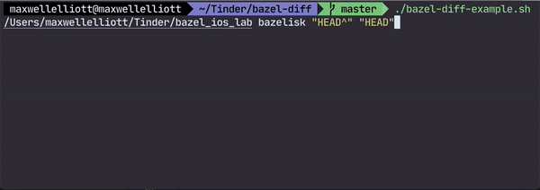

# bazel-diff

[](https://github.com/Tinder/bazel-diff/actions/workflows/ci.yaml)
[](https://github.com/Tinder/bazel-diff/actions/workflows/ci.yaml)

`bazel-diff` is a command line tool for Bazel projects that allows users to determine the exact affected set of impacted targets between two Git revisions. Using this set, users can test or build the exact modified set of targets.

`bazel-diff` offers several key advantages over rolling your own target diffing solution

1. `bazel-diff` is designed for very large Bazel projects. We stream Bazel Query's `streamed_proto` output message by message instead of loading it whole, which allows you to parse Gigabyte or larger protobuf outputs. We have tested it with projects containing hundreds of thousands of targets.
2. We avoid usage of large command line query lists when interacting with Bazel, [issue here](https://github.com/bazelbuild/bazel/issues/8609). When you interact with Bazel with thousands of query parameters you can reach an upper maximum limit, seeing this error `bash: /usr/local/bin/bazel: Argument list too long`. `bazel-diff` is smart enough to avoid these errors.
3. `bazel-diff` has been tested with file renames, deletions, and modifications. Works on `bzl` files, `WORKSPACE` files, `BUILD` files and regular files

Track the feature request for target diffing in Bazel [here](https://github.com/bazelbuild/bazel/issues/7962)

This approach was inspired by the [following BazelConf talk](https://www.youtube.com/watch?v=9Dk7mtIm7_A) by Benjamin Peterson.

> There are simpler and faster ways to approximate the affected set of targets.
> However an incorrect solution can result in a system you can't trust,
> because tests could be broken at a commit where you didn't select to run them.
> Then you can't rely on green-to-red (or red-to-green) transitions and
> lose much of the value from your CI system as breakages can be discovered
> later on unrelated commits.

## Prerequisites

* Git
* Bazel 7 or higher (Bazel itself needs a JDK; `bazel-diff` is a single static binary and does not)

## Getting Started

To start using `bazel-diff` immediately, simply clone down the repo and then run the example shell script:

```terminal
git clone https://github.com/Tinder/bazel-diff.git
cd bazel-diff
./bazel-diff-example.sh WORKSPACE_PATH BAZEL_PATH START_GIT_REVISION END_GIT_REVISION
```

Here is a breakdown of those arguments:

* `WORKSPACE_PATH`: Path to directory containing your `WORKSPACE` file in your Bazel project.
* `BAZEL_PATH`: Path to your Bazel executable
* `START_GIT_REVISION`: Starting Git Branch or SHA for your desired commit range
* `END_GIT_REVISION`: Final Git Branch or SHA for your desired commit range

You can see the example shell script in action below:



Open `bazel-diff-example.sh` to see how this is implemented. This is purely an example use-case, but it is a great starting point to using `bazel-diff`.

## With Aspect CLI

Aspect's Extension Language (AXL) allows the shell script above to be expressed in Starlark, and exposed as an `impacted` command on your terminal.

See https://github.com/aspect-extensions/impacted

## How it works

`bazel-diff` works as follows

* The previous revision is checked out, then we run `generate-hashes`. This gives us the hashmap representation for the entire Bazel graph, then we write this JSON to a file.

* Next we checkout the initial revision, then we run `generate-hashes` and write that JSON to a file. Now we have our final hashmap representation for the Bazel graph.

* We run `bazel-diff` on the starting and final JSON hash filepaths to get our impacted set of targets. This impacted set of targets is written to a file.

## Build Graph Distance Metrics

`bazel-diff` can optionally compute build graph distance metrics between two revisions. This is
useful for understanding the impact of a change on the build graph. Directly impacted targets are
targets that have had their rule attributes or source file dependencies changed. Indirectly impacted
targets are that are impacted only due to a change in one of their target dependencies.

For each target, the following metrics are computed:

* `target_distance`: The number of dependency hops that it takes to get from an impacted target to a directly impacted target.
* `package_distance`: The number of dependency hops that cross a package boundary to get from an impacted target to a directly impacted target.

Build graph distance metrics can be used by downstream tools to power features such as:

* Only running sanitizers on impacted tests that are in the same package as a directly impacted target.
* Only running large-sized tests that are within a few package hops of a directly impacted target.
* Only running computationally expensive jobs when an impacted target is within a certain distance of a directly impacted target.

To enable this feature, you must generate a dependency mapping on your final revision when computing hashes, then pass it into the `get-impacted-targets` command.

```bash
git checkout BASE_REV
bazel-diff generate-hashes -w /path/to/workspace -b bazel starting_hashes.json

git checkout FINAL_REV
bazel-diff generate-hashes -w /path/to/workspace -b bazel --depEdgesFile deps.json final_hashes.json

bazel-diff get-impacted-targets -w /path/to/workspace -b bazel -sh starting_hashes.json -fh final_hashes.json --depEdgesFile deps.json -o impacted_targets.json
```

This will produce an impacted targets json list with target label, target distance, and package distance:

```text
[
  {"label": "//foo:bar", "targetDistance": 0, "packageDistance": 0},
  {"label": "//foo:baz", "targetDistance": 1, "packageDistance": 0},
  {"label": "//bar:qux", "targetDistance": 1, "packageDistance": 1}
]
```

## Explaining Why a Target Was Impacted

`get-impacted-targets` tells you *that* `//service/a:app` needs rebuilding. It does not tell you
*why* — and a service can be impacted for several reasons at once: it changed itself, a shared
module it depends on changed, or both. `explain` answers that question by attributing the target's
hash change to the upstream target(s) actually responsible, and by showing the dependency path the
change travelled along. See [issue #479](https://github.com/Tinder/bazel-diff/issues/479).

It reads the same three files `get-impacted-targets` consumes — it runs no `bazel query` and needs
no workspace — so it is cheap to run after the fact on a CI machine that only kept the artifacts:

```bash
bazel-diff generate-hashes -w /path/to/workspace -b bazel --depEdgesFile deps.json final_hashes.json

bazel-diff explain \
  -sh starting_hashes.json \
  -fh final_hashes.json \
  -d deps.json \
  --target //service/a:app
```

```text
//service/a:app  [Rule]
IMPACTED (directly -- this target changed on its own)

Root causes: 3

  1. //service/a:app  [Rule]
     the rule's own definition or attributes changed
     0 hops -- this is the queried target itself
     //service/a:app

  2. //service/a:main.py  [SourceFile]
     source file content changed
     1 hop (0 package boundaries crossed)
     //service/a:main.py -> //service/a:app

  3. //common/data:util.py  [SourceFile]
     source file content changed
     3 hops (2 package boundaries crossed)
     //common/data:util.py -> //common:gen_srcs -> //common:lib -> //service/a:app
```

A **root cause** is a target whose *own* hash changed — its `directHash` moved, or it is new in the
final revision. Everything between a root cause and the queried target merely carried the change
downstream. This is the same DIRECT/INDIRECT classification that backs the distance metrics above,
so `explain` and `--depEdgesFile` always agree on which targets are roots.

`--depEdgesFile` is required: attribution is a walk over those edges. Generate it with
`generate-hashes --depEdgesFile` (or, on the query service, fetch it from `GET /dependency_edges`).

### Visualizing the blame graph

`--format dot` and `--format mermaid` emit the blame subgraph — the queried target, the root causes,
and the targets that carried the change between them. Only that subgraph is rendered, never the
whole impacted set, which is what keeps the output readable on a monorepo.

```bash
bazel-diff explain -sh starting_hashes.json -fh final_hashes.json -d deps.json \
  --target //service/a:app --format dot -o why.dot
dot -Tsvg why.dot -o why.svg
```

Edges point in **impact-propagation** direction — root cause at the top, queried target at the
bottom — so reading downward follows the change as it flows in. (This is the reverse of the
`--depEdgesFile` orientation, which maps a label to the deps it consumes.)

`--format mermaid` emits a `flowchart TD` that renders inline in a GitHub comment or PR description,
which is handy for posting "here is why your PR rebuilt these targets" from CI. Each role has its
own border color *and* node shape *and* an explicit role label, so the graph stays readable in
monochrome and for viewers who cannot separate the two hues.

`--format json` gives the same data structurally (root causes, paths, nodes, edges) for feeding
another tool.

### Bounding the output

A target deep in a monorepo can have a great many root causes. Two knobs bound the work, and
neither ever truncates silently — the full count is always reported:

* `--maxRootCauses` (default `25`) reports only the nearest N root causes. `0` means all of them.
* `--maxDepth` (default `-1`, unbounded) stops the search N dependency hops above the queried
  target. When a bound cuts the search short, a warning says so.

## Query Service

`bazel-diff serve` is production ready — it has been validated internally in production CI and is
supported for production use.

Instead of running `generate-hashes` from scratch on every CI invocation, you can run `bazel-diff` as
a long-running HTTP service that answers affectedness queries between two git revisions and caches
the generated hashes per commit SHA. This is the "bazel-diff as a service" model described in the
[BazelCon talk](https://youtu.be/9Dk7mtIm7_A?t=1875) that inspired this repo (see
[issue #29](https://github.com/Tinder/bazel-diff/issues/29)).

Start the service against a dedicated git clone of your workspace:

```bash
bazel-diff serve \
  --workspacePath /path/to/workspace-clone \
  --bazelPath bazel \
  --cacheDir /var/cache/bazel-diff \
  --port 8080
```

On startup the service performs an initial `git fetch` and only then reports healthy. For each
request it resolves the `from`/`to` revisions, generates (and caches, keyed by commit SHA) the hashes
for each, and reuses the exact same affectedness logic as `get-impacted-targets`.

Endpoints:

* `GET /health` — returns `200 OK` once the initial fetch has completed, `503` otherwise. A load
  balancer should use this to route only to ready instances. If a fatal git error occurs at startup
  the instance "lame-ducks" itself by continuing to report `503` so the load balancer removes it.
* `GET /impacted_targets?from=<rev>&to=<rev>` — returns the impacted targets as JSON. The optional
  `targetType` parameter (e.g. `&targetType=Rule,SourceFile`) filters by target type.

```bash
curl 'http://localhost:8080/impacted_targets?from=main&to=my-feature-branch'
```

```json
{
  "from": "9a1c0e2…",
  "to": "3f7b8d4…",
  "impactedTargets": ["//foo:bar", "//foo:baz"]
}
```

* `POST /impacted_targets` — the same query as a JSON body, which additionally accepts a
  `modifiedFilepaths` list to speed up cold hashing on large repositories. Body fields: `from` and
  `to` (required), `targetType` (optional array), and `modifiedFilepaths` (optional array of
  workspace-relative paths that changed between the two revisions, e.g. from
  `git diff --name-only <from> <to>`). When `modifiedFilepaths` is present the server reads and
  hashes the *content* of only those files on **both** revisions and treats every other source file
  as unchanged, turning an O(all source files) content read into O(changed files) — the same
  optimization as `generate-hashes --modified-filepaths`. The list must be a **superset** of what
  actually changed: a truly-changed file left off it is content-skipped on both sides and its
  impacted targets are missed, so treat the list as a correctness contract. Omit it (or send `[]`)
  for the full-content hash, identical to the GET form. `POST /impacted_targets_with_distances` accepts the same body.

```bash
curl -X POST http://localhost:8080/impacted_targets \
  -H 'Content-Type: application/json' \
  -d '{"from":"main","to":"my-feature-branch","modifiedFilepaths":["foo/BUILD.bazel","foo/bar.py"]}'
```

* `GET /impacted_targets_with_distances?from=<rev>&to=<rev>` — like `/impacted_targets`, but each
  impacted target is annotated with its build-graph distance metrics: `targetDistance` (the number of
  dependency hops to the nearest directly-changed target) and `packageDistance` (how many of those
  hops cross a package boundary). Directly-changed targets sit at distance `0`. Requires the server
  to have been started with `--trackDeps` (see below); otherwise this endpoint returns `400`. The
  same optional `targetType` filter applies.

```bash
curl 'http://localhost:8080/impacted_targets_with_distances?from=main&to=my-feature-branch'
```

```json
{
  "from": "9a1c0e2…",
  "to": "3f7b8d4…",
  "impactedTargets": [
    {"label": "//foo:bar", "targetDistance": 0, "packageDistance": 0},
    {"label": "//foo:baz", "targetDistance": 1, "packageDistance": 1}
  ]
}
```

* `GET /dependency_edges?from=<rev>&to=<rev>` — returns the generate-hashes dependency-edge graph
  for the **`to` revision**, byte-compatible with `generate-hashes --depEdgesFile`. The body is a JSON
  object mapping each label to its direct deps — **not** the per-target distance summary from
  `/impacted_targets_with_distances`, and not wrapped in `from`/`to`/`impactedTargets`. Requires
  `--trackDeps`; otherwise this endpoint returns `400`. `profile=true` is accepted and ignored so
  clients can reuse the same query string as the other endpoints. The graph is always the full
  (unscoped) map; `modifiedFilepaths` on POST does not shrink it.

```bash
curl 'http://localhost:8080/dependency_edges?from=main&to=my-feature-branch'
```

```json
{
  "//foo:bar": ["//foo:lib", "//bar:baz"]
}
```

* `GET /metrics` — returns a JSON snapshot of the instance so callers and monitoring can see its
  identity, liveness, and cache size usage without scraping logs. Unlike the query endpoints it is
  never gated on readiness, so it still responds on an un-ready or lame-ducked instance (the `ready`
  field reports the current state). The `cache` size fields are populated for the local-disk backend
  and are `null` for a backend whose size is not cheaply knowable in-process.

```bash
curl 'http://localhost:8080/metrics'
```

```json
{
  "version": "31.4.0",
  "uptimeSeconds": 3600,
  "ready": true,
  "gitEngine": "subprocess",
  "trackDeps": false,
  "cache": {"directory": "/var/cache/bazel-diff", "remote": "s3://my-bucket/bazel-diff/", "entries": 128, "sizeBytes": 4823913, "sizeHuman": "4.6 MB"},
  "jvm": {"usedBytes": 123456789, "maxBytes": 2147483648}
}
```

### Shared S3 cache for multi-instance deployments

A single instance caches hashes on local disk only. When you run several replicas behind a load
balancer (e.g. a Kubernetes Deployment behind a Service, with the readiness probe on `/health`),
give them a shared S3 cache tier so a revision is cold-hashed once fleet-wide instead of once per
pod:

```bash
bazel-diff serve \
  --workspacePath /path/to/workspace-clone \
  --cacheDir /var/cache/bazel-diff \
  --s3Bucket my-hash-cache-bucket \
  --s3Prefix bazel-diff/my-repo
```

With `--s3Bucket` set the cache becomes two-tiered: reads check local disk first and fall back to
the bucket (backfilling local disk on a hit), and every generated entry is published to both, so
any replica can serve a revision another replica already hashed. Credentials and region resolve
through the standard AWS default provider chains (environment variables, profile, IRSA web
identity on EKS, IMDS), or pin the region with `--s3Region`. `--s3Endpoint` plus
`--s3ForcePathStyle` point the client at an S3-compatible store (MinIO, LocalStack) for local
testing.

S3 errors never fail a request: a failed read is treated as a cache miss (the revision is
regenerated — slower, but correct) and a failed write leaves the entry local-only, so an S3 outage
degrades throughput rather than availability. Concurrent replicas racing to hash the same
revision are also harmless — entries are deterministic per key, so last-write-wins over identical
content. The `--cacheMax*` pruning flags bound the *local* tier only; bound the bucket with an S3
lifecycle policy instead.

Notes and operational guidance:

* Distance metrics (`/impacted_targets_with_distances`) and the generate-hashes graph
  (`/dependency_edges`) require the dependency-edge graph, which is
  only tracked when the server is started with `--trackDeps`. Tracking deps grows each cached hash
  entry, so it is opt-in. The flag is folded into the cache key, so enabling or disabling it never
  reuses a previously cached entry of the other kind. This mirrors the `generate-hashes --depEdgesFile`
  / `get-impacted-targets --depEdgesFile` flow used by the CLI.

* Dependency fingerprinting (`--dependencyFingerprint`) is opt-in. When enabled, every generated
  cache entry records a fingerprint of the workspace's external-dependency state (the bzlmod module
  graph and the resolved repository definitions, via `bazel mod`), and a cached entry -- local or
  S3 -- is only served when that fingerprint still matches the checked-out revision; entries
  without a fingerprint, or with a stale one, are regenerated. This catches hashes that went stale
  because an external repository changed underneath an unchanged commit, at the cost of a checkout
  and a `bazel mod` round trip on every cache lookup. It is off by default, in which case a cache
  entry is trusted on its key alone and the fingerprint is neither computed nor stored. The flag is
  not part of the cache key: a guarded server rewrites unguarded entries with a fingerprint as it
  regenerates them, and an unguarded server serves guarded entries as-is.

* The service checks out revisions inside `--workspacePath`, so point it at a dedicated clone, not a
  working tree you edit. All workspace-mutating work (git checkout + `bazel query`) is serialized,
  so a single instance answers one cold query at a time; the per-SHA cache absorbs the rest.
* Git operations (fetch and checkout) shell out to the `git` binary at `--gitPath` (default `git`
  on the `PATH`), so a `git` binary must be available on the host. The working tree is checked out
  on disk for `bazel query` to read. Because native git performs every fetch, all clone shapes are
  supported -- including shallow (`--depth`) and partial (`--filter=blob:none`) clones, whose thin
  packs are delta-compressed against objects the clone does not have.
* Hashes are cached on local disk via `--cacheDir` and survive restarts. Left unbounded the cache
  grows by one entry per distinct commit SHA queried, so a long-running server can bound it with any
  combination of `--cacheMaxAge` (expire entries not read or written within a window, e.g. `7d`),
  `--cacheMaxEntries`, and `--cacheMaxSize` (e.g. `10GB`, `500MB`, or a bare byte count). A background
  sweeper enforces the limits once at startup and then every `--cachePruneInterval` (default `1h`),
  evicting least-recently-used entries first — a cache hit refreshes an entry's recency, so revisions
  under active query are not expired out from under live traffic. With no `--cacheMax*` flag set the
  cache is never pruned (the previous behavior). The `--cacheMax*` flags always bound the local-disk
  tier only; the shared S3 tier (see above) manages its own retention via a bucket lifecycle policy.
* Query-affecting flags (`--useCquery`, `--fineGrainedHashExternalRepos`, etc.) mirror
  `generate-hashes`, and are folded into the cache key so a server started with different flags never
  serves another configuration's cached hashes.
* `modifiedFilepaths` (POST only) is scoped per request, not a server flag. A scoped hash of a
  revision is only comparable to another revision hashed with the *same* set, so cached scoped
  entries are keyed by `<sha>.<fingerprint>.<digest-of-the-set>` — never mixed with, or served in
  place of, the full-content `<sha>.<fingerprint>` entry. The trade-off: on the scoped path the
  shared-base full-hash cache is not reused (each distinct changed-set re-hashes the base), but each
  such hash is cheaper because it skips reading unchanged files. The extra entries are bounded by the
  same LRU `--cacheMax*` pruning as everything else.
* Containerization and multi-instance deployment manifests are not yet included; the shared S3
  cache tier above is the building block for running replicas behind a load balancer.

<!-- BEGIN_SECTION: cli-help -->
## CLI Interface

`bazel-diff` Command

```terminal
Writes impacted targets between two Bazel graph hash files

Usage: bazel-diff [OPTIONS] <COMMAND>

Commands:
  generate-hashes       Write canonical hashes for Bazel targets in a workspace
  get-impacted-targets  Compare two hash files and report impacted targets
  explain               Explain why a target was impacted: the upstream target(s) whose own hash changed, and the dependency path from each down to the queried target. Renders as text, JSON, Graphviz DOT, or a Mermaid flowchart.
  warmup                Warm Bazel and write snapshot hashes and fingerprint metadata
  fingerprint           Compute the snapshot/cache fingerprint for the current workspace
  serve                 Run the HTTP impacted-target query service
  help                  Print this message or the help of the given subcommand(s)

Options:
  -v, --verbose  
  -h, --help     Print help
  -V, --version  Print version
```

### `generate-hashes` command

```terminal
Write canonical hashes for Bazel targets in a workspace

Usage: bazel-diff generate-hashes [OPTIONS] --workspacePath <WORKSPACE_PATH> [OUTPUT_PATH]

Arguments:
  [OUTPUT_PATH]  

Options:
  -v, --verbose
          
  -w, --workspacePath <WORKSPACE_PATH>
          Path to the Bazel workspace
  -b, --bazelPath <BAZEL_PATH>
          Path to the Bazel or Bazelisk executable [default: bazel]
  -s, --seed-filepaths <SEED_FILEPATHS>
          File containing workspace-relative paths whose contents seed every target hash
      --bazelStartupOptions <BAZEL_STARTUP_OPTIONS>
          Additional space-separated Bazel startup options
      --bazelCommandOptions <BAZEL_COMMAND_OPTIONS>
          Additional space-separated `bazel query` options
      --cqueryCommandOptions <CQUERY_COMMAND_OPTIONS>
          Additional space-separated `bazel cquery` options
      --fineGrainedHashExternalRepos <FINE_GRAINED_HASH_EXTERNAL_REPOS>
          
      --fineGrainedHashExternalReposFile <FINE_GRAINED_HASH_EXTERNAL_REPOS_FILE>
          
      --useCquery[=<USE_CQUERY>]
          [default: false] [possible values: true, false]
      --cqueryExpression <CQUERY_EXPRESSION>
          
  -k, --keep_going[=<KEEP_GOING>]
          [default: false] [possible values: true, false]
      --ignoredRuleHashingAttributes <IGNORED_RULE_HASHING_ATTRIBUTES>
          
      --excludeExternalTargets[=<EXCLUDE_EXTERNAL_TARGETS>]
          [default: false] [possible values: true, false]
      --excludeTargetsQuery <EXCLUDE_TARGETS_QUERY>
          
      --alwaysAffectedTags <ALWAYS_AFFECTED_TAGS>
          
      --contentHashPath <CONTENT_HASH_PATH>
          
      --includeTargetType[=<INCLUDE_TARGET_TYPE>]
          [default: false] [possible values: true, false]
      --targetType <TARGET_TYPE>
          
  -d, --depEdgesFile <DEP_EDGES_FILE>
          
  -m, --modified-filepaths <MODIFIED_FILEPATHS>
          
  -h, --help
          Print help
  -V, --version
          Print version
```

### `get-impacted-targets` command

```terminal
Compare two hash files and report impacted targets

Usage: bazel-diff get-impacted-targets [OPTIONS] --startingHashes <STARTING_HASHES> --finalHashes <FINAL_HASHES> --workspacePath <WORKSPACE_PATH>

Options:
      --startingHashes <STARTING_HASHES>
          
  -v, --verbose
          
      --finalHashes <FINAL_HASHES>
          
  -d, --depEdgesFile <DEP_EDGES_FILE>
          
      --targetType <TARGET_TYPE>
          
  -o, --output <OUTPUT>
          
  -w, --workspacePath <WORKSPACE_PATH>
          
  -b, --bazelPath <BAZEL_PATH>
          [default: bazel]
      --bazelStartupOptions <BAZEL_STARTUP_OPTIONS>
          
      --noBazelrc[=<NO_BAZELRC>]
          [default: false] [possible values: true, false]
      --excludeExternalTargets[=<EXCLUDE_EXTERNAL_TARGETS>]
          [possible values: true, false]
  -h, --help
          Print help
  -V, --version
          Print version
```

### `explain` command

```terminal
Explain why a target was impacted: the upstream target(s) whose own hash changed, and the dependency path from each down to the queried target. Renders as text, JSON, Graphviz DOT, or a Mermaid flowchart.

Usage: bazel-diff explain [OPTIONS] --startingHashes <STARTING_HASHES> --finalHashes <FINAL_HASHES> --depEdgesFile <DEP_EDGES_FILE> --target <TARGET>

Options:
      --startingHashes <STARTING_HASHES>
          The JSON file of target hashes for the initial revision, from `generate-hashes`

  -v, --verbose
          

      --finalHashes <FINAL_HASHES>
          The JSON file of target hashes for the final revision, from `generate-hashes`

  -d, --depEdgesFile <DEP_EDGES_FILE>
          The dependency-edges file written by `generate-hashes --depEdgesFile`. Required: attribution is a walk over these edges

  -t, --target <TARGET>
          The impacted Bazel label to explain, e.g. '//service/a:app'

  -f, --format <FORMAT>
          Output format

          Possible values:
          - text
          - json
          - dot:     A Graphviz node-link graph of the blame subgraph, edges from root cause to queried target
          - mermaid: A Mermaid `flowchart TD` of the same graph
          
          [default: text]

  -o, --output <OUTPUT>
          Filepath to write the explanation to. Defaults to STDOUT

      --maxRootCauses <MAX_ROOT_CAUSES>
          Report at most this many root causes, nearest first. The full count is always reported alongside. 0 means no limit
          
          [default: 25]

      --maxDepth <MAX_DEPTH>
          Stop searching this many dependency hops above the queried target. Root causes further upstream are then not reported (a warning is printed). -1 means no bound
          
          [default: -1]

  -h, --help
          Print help (see a summary with '-h')

  -V, --version
          Print version
```

### `serve` command

```terminal
Run the HTTP impacted-target query service

Usage: bazel-diff serve [OPTIONS] --workspacePath <WORKSPACE_PATH> --cacheDir <CACHE_DIR>

Options:
  -v, --verbose
          
  -w, --workspacePath <WORKSPACE_PATH>
          Path to the Bazel workspace
  -b, --bazelPath <BAZEL_PATH>
          Path to the Bazel or Bazelisk executable [default: bazel]
  -s, --seed-filepaths <SEED_FILEPATHS>
          File containing workspace-relative paths whose contents seed every target hash
      --bazelStartupOptions <BAZEL_STARTUP_OPTIONS>
          Additional space-separated Bazel startup options
      --bazelCommandOptions <BAZEL_COMMAND_OPTIONS>
          Additional space-separated `bazel query` options
      --cqueryCommandOptions <CQUERY_COMMAND_OPTIONS>
          Additional space-separated `bazel cquery` options
      --fineGrainedHashExternalRepos <FINE_GRAINED_HASH_EXTERNAL_REPOS>
          
      --fineGrainedHashExternalReposFile <FINE_GRAINED_HASH_EXTERNAL_REPOS_FILE>
          
      --useCquery[=<USE_CQUERY>]
          [default: false] [possible values: true, false]
      --cqueryExpression <CQUERY_EXPRESSION>
          
  -k, --keep_going[=<KEEP_GOING>]
          [default: false] [possible values: true, false]
      --ignoredRuleHashingAttributes <IGNORED_RULE_HASHING_ATTRIBUTES>
          
      --excludeExternalTargets[=<EXCLUDE_EXTERNAL_TARGETS>]
          [default: false] [possible values: true, false]
      --excludeTargetsQuery <EXCLUDE_TARGETS_QUERY>
          
      --alwaysAffectedTags <ALWAYS_AFFECTED_TAGS>
          
      --gitPath <GIT_PATH>
          [default: git]
      --port <PORT>
          [default: 8080]
      --requestTimeout <REQUEST_TIMEOUT>
          [default: 0]
      --cacheDir <CACHE_DIR>
          
      --trackDeps[=<TRACK_DEPS>]
          [default: false] [possible values: true, false]
      --dependencyFingerprint[=<DEPENDENCY_FINGERPRINT>]
          Opt-in: only serve cached entries whose external-dependency fingerprint still matches [default: false] [possible values: true, false]
      --no-initial-fetch
          
      --warmupRevision <WARMUP_REVISIONS>
          
      --cacheMaxAge <CACHE_MAX_AGE>
          
      --cacheMaxEntries <CACHE_MAX_ENTRIES>
          
      --cacheMaxSize <CACHE_MAX_SIZE>
          
      --cachePruneInterval <CACHE_PRUNE_INTERVAL>
          [default: 1h]
      --s3Bucket <S3_BUCKET>
          
      --s3Prefix <S3_PREFIX>
          [default: ""]
      --s3Region <S3_REGION>
          
      --s3Endpoint <S3_ENDPOINT>
          
      --s3ForcePathStyle
          
  -h, --help
          Print help
  -V, --version
          Print version
```
<!-- END_SECTION: cli-help -->

### What does the SHA256 value of `generate-hashes` represent?

`generate-hashes` is a canonical SHA256 value representing all attributes and inputs into a target. These inputs
are the summation of the rule implementation hash, the SHA256 value
for every attribute of the rule and then the summation of the SHA256 value for
all `rule_inputs` using the same exact algorithm. For source_file inputs the
content of the file are converted into a SHA256 value.

## Installing

### Prebuilt binaries (recommended)

Every [release](https://github.com/Tinder/bazel-diff/releases) ships a single self-contained
binary per platform. The Linux binaries are statically linked against musl, so they run on any
distribution (including Alpine and images older than the build runner) with no libc or JVM
requirement:

```terminal
# Linux amd64
curl -Lo bazel-diff https://github.com/Tinder/bazel-diff/releases/latest/download/bazel-diff-rust-linux-amd64
chmod +x bazel-diff

# Linux arm64
curl -Lo bazel-diff https://github.com/Tinder/bazel-diff/releases/latest/download/bazel-diff-rust-linux-arm64
chmod +x bazel-diff

# macOS arm64
curl -Lo bazel-diff https://github.com/Tinder/bazel-diff/releases/latest/download/bazel-diff-rust-macos-arm64
chmod +x bazel-diff
```

Windows amd64: download `bazel-diff-rust-windows-amd64.exe` from the
[latest release](https://github.com/Tinder/bazel-diff/releases/latest).

### Integrate into your project

Add the following to your `MODULE.bazel`:

```bazel
bazel_dep(name = "bazel-diff", version = "49.0.1")
```

You can now run the tool with:

```terminal
bazel run @bazel-diff//:bazel-diff -- --help
```

(`@bazel-diff//:bazel-diff-rust` still resolves to the same binary for projects that adopted
it under that name.) bazel-diff is bzlmod-only; there is no `WORKSPACE` integration.

### Build from Source

After cloning down the repo, you are good to go, Bazel will handle the rest

To run the project

```terminal
bazel run :bazel-diff -- --help
```

To build the same binaries a release publishes (Bazel names the output for the platform it
was built for, `bazel-bin/release/bazel-diff-rust-<os>-<arch>[.exe]`):

```terminal
make release_rust_binary              # bazel build //release:bazel-diff-rust --config=release
make release_rust_binary_linux        # ... --config=release-musl
make release_rust_binary_linux_arm64  # ... --config=release-musl-arm64
```

`--config=release-musl` and `--config=release-musl-arm64` target
`//platforms:linux_x86_64_musl` and `//platforms:linux_aarch64_musl`, which select a musl Rust
std and a musl C toolchain, so the Linux assets are statically linked instead of inheriting the
build runner's glibc as a version floor. They are cross-compiles: the same commands produce
`bazel-diff-rust-linux-amd64` and `bazel-diff-rust-linux-arm64` on a glibc Linux host and on an
Apple Silicon Mac.

#### Debugging (when running from source)

To run `bazel-diff` with debug logging, run your commands with the `verbose` config like so:

```terminal
bazel run :bazel-diff --config=verbose -- --help
```

## Contributors

<!-- BEGIN_SECTION: contributors -->
<table>
  <tr>
    <td align="center"><a href="https://github.com/tinder-maxwellelliott"><br/><sub><b>Maxwell Elliott</b></sub></a></td>
    <td align="center"><a href="https://github.com/honnix"><br/><sub><b>Honnix</b></sub></a></td>
    <td align="center"><a href="https://github.com/fa93hws"><br/><sub><b>eric wang</b></sub></a></td>
    <td align="center"><a href="https://github.com/fa93hws"><br/><sub><b>Eric Wang</b></sub></a></td>
    <td align="center"><a href="https://github.com/tgeng"><br/><sub><b>Tianyu Geng</b></sub></a></td>
    <td align="center"><a href="https://github.com/BalestraPatrick"><br/><sub><b>Patrick Balestra</b></sub></a></td>
  </tr>
  <tr>
    <td align="center"><a href="https://github.com/purkhusid"><br/><sub><b>Daniel P. Purkhus</b></sub></a></td>
    <td align="center"><a href="https://github.com/alexeagle"><br/><sub><b>Alex Eagle</b></sub></a></td>
    <td align="center"><a href="https://github.com/Malinskiy"><br/><sub><b>Anton Malinskiy</b></sub></a></td>
    <td align="center"><a href="https://github.com/rdark"><br/><sub><b>rdark</b></sub></a></td>
    <td align="center"><a href="https://github.com/ViggedalZenseact"><br/><sub><b>ViggedalZenseact</b></sub></a></td>
    <td align="center"><a href="https://github.com/corypaik"><br/><sub><b>Cory Paik</b></sub></a></td>
  </tr>
  <tr>
    <td align="center"><a href="https://github.com/thirtyseven"><br/><sub><b>Ted Kaplan</b></sub></a></td>
    <td align="center"><a href="https://github.com/sharmila-oai"><br/><sub><b>Sharmila</b></sub></a></td>
    <td align="center"><a href="https://github.com/dkostyrev"><br/><sub><b>Dmitrii Kostyrev</b></sub></a></td>
    <td align="center"><a href="https://github.com/jmthvt"><br/><sub><b>Jérémy Mathevet</b></sub></a></td>
    <td align="center"><a href="https://github.com/nikhilbirmiwal"><br/><sub><b>Nikhil Birmiwal</b></sub></a></td>
    <td align="center"><a href="https://github.com/morozov"><br/><sub><b>Sergei Morozov</b></sub></a></td>
  </tr>
  <tr>
    <td align="center"><a href="https://github.com/fahhem"><br/><sub><b>Fahrzin Hemmati</b></sub></a></td>
    <td align="center"><a href="https://github.com/JaimeLennox"><br/><sub><b>Jaime Lennox</b></sub></a></td>
    <td align="center"><a href="https://github.com/lukasmi93"><br/><sub><b>lukasmi93</b></sub></a></td>
    <td align="center"><a href="https://github.com/tinder-cwybranowski"><br/><sub><b>Connor Wybranowski</b></sub></a></td>
    <td align="center"><a href="https://github.com/ihasdapie"><br/><sub><b>Brian</b></sub></a></td>
    <td align="center"><a href="https://github.com/hazel-sudzilouski-ai"><br/><sub><b>hazel-sudzilouski-ai</b></sub></a></td>
  </tr>
  <tr>
    <td align="center"><a href="https://github.com/csmoe"><br/><sub><b>csmoe</b></sub></a></td>
    <td align="center"><a href="https://github.com/SimonFoobar648"><br/><sub><b>SimonFoobar648</b></sub></a></td>
    <td align="center"><a href="https://github.com/dgollahon-plaid"><br/><sub><b>dgollahon-plaid</b></sub></a></td>
    <td align="center"><a href="https://github.com/jmwachtel"><br/><sub><b>jmwachtel</b></sub></a></td>
    <td align="center"><a href="https://github.com/Ahajha"><br/><sub><b>Alex Trotta</b></sub></a></td>
    <td align="center"><a href="https://github.com/nollbit"><br/><sub><b>Johan Mjönes</b></sub></a></td>
  </tr>
  <tr>
    <td align="center"><a href="https://github.com/lucasteixeira-cb"><br/><sub><b>Lucas Teixeira</b></sub></a></td>
    <td align="center"><a href="https://github.com/GuillaumeVW"><br/><sub><b>Guillaume Van Wassenhove</b></sub></a></td>
    <td align="center"><a href="https://github.com/fmeum"><br/><sub><b>Fabian Meumertzheim</b></sub></a></td>
    <td align="center"><a href="https://github.com/blockjon-dd"><br/><sub><b>Jonathan Block</b></sub></a></td>
    <td align="center"><a href="https://github.com/alex-torok"><br/><sub><b>Alex Torok</b></sub></a></td>
    <td align="center"><a href="https://github.com/naveenOnarayanan"><br/><sub><b>Naveen Narayanan</b></sub></a></td>
  </tr>
  <tr>
    <td align="center"><a href="https://github.com/OniOni"><br/><sub><b>Mathieu Sabourin</b></sub></a></td>
    <td align="center"><a href="https://github.com/andre-alves"><br/><sub><b>André</b></sub></a></td>
    <td align="center"><a href="https://github.com/bz-canva"><br/><sub><b>Boris</b></sub></a></td>
    <td align="center"><a href="https://github.com/chenrui333"><br/><sub><b>Rui Chen</b></sub></a></td>
    <td align="center"><a href="https://github.com/sanju-naik"><br/><sub><b>Sanju Naik</b></sub></a></td>
    <td align="center"><a href="https://github.com/lalten"><br/><sub><b>Laurenz</b></sub></a></td>
  </tr>
  <tr>
    <td align="center"><a href="https://github.com/molar"><br/><sub><b>mla</b></sub></a></td>
    <td align="center"><a href="https://github.com/tinder-yukisawa"><br/><sub><b>tinder-yukisawa</b></sub></a></td>
    <td align="center"><a href="https://github.com/KevinJiao"><br/><sub><b>Kevin Jiao</b></sub></a></td>
    <td align="center"><a href="https://github.com/vcase"><br/><sub><b>Vincent Case</b></sub></a></td>
    <td align="center"><a href="https://github.com/fh-wpanfil"><br/><sub><b>Walt Panfil</b></sub></a></td>
    <td align="center"><a href="https://github.com/mehran-prs"><br/><sub><b>Mehran Poursadeghi</b></sub></a></td>
  </tr>
</table>
<!-- END_SECTION: contributors -->

## Learn More

Take a look at the following bazelcon talks to learn more about `bazel-diff`:

* [BazelCon 2023: Improving CI efficiency with Bazel querying and bazel-diff](https://www.youtube.com/watch?v=QYAbmE_1fSo)
* [BazelCon 2024: Not Going the Distance: Filtering Tests by Build Graph Distance](https://youtu.be/Or0o0Q7Zc1w?si=nIIkTH6TP-pcPoRx)
* [BazelCon 2025:
Precision CI at Scale: Target-Aware Workflows with Bazel Diff - Maxwell Elliott & Connor Wybranowski](https://youtu.be/rCFc3tFcVVE?si=WF8HdCyOBQEAHGL4)

## Star History

<a href="https://star-history.dera.page/#Tinder/bazel-diff&type=Date">
  <picture>
    <source media="(prefers-color-scheme: dark)" srcset="https://star-history.dera.page/svg?repos=Tinder/bazel-diff&type=Date&theme=dark" />
    <source media="(prefers-color-scheme: light)" srcset="https://star-history.dera.page/svg?repos=Tinder/bazel-diff&type=Date" />
    
  </picture>
</a>

## Running the tests

The unit tests, lint gates and tooling tests:

```terminal
bazel test //:rust_tests //:rust_clippy_check //:rust_format_check //tools/...
```

The end-to-end suite drives the real binary against fixture workspaces with a nested Bazel,
one target per case (see [`tools/e2e/README.md`](tools/e2e/README.md)):

```terminal
bazel test //tests:e2e_test
```

## Code coverage

CI enforces a minimum **90% line coverage** on production sources. Rust
(`src/...`, `tools/coverage/src/...`) and Go (`tools/go/...`) are gated
**independently** at 90% each, so thin coverage in one language can't hide
behind well-covered code in another. To run the same checks locally:

```terminal
make coverage
```

This invokes
`bazel coverage --combined_report=lcov //src:cli_tests //src:rust_tests //tools:coverage_check_test //tools/coverage/... //tools/go/...`
and then runs `//tools:coverage-check` twice against the resulting LCOV report — once for
the Rust sources and once scoped to `tools/go/` (`--include tools/go/`). The check is
a Python `py_binary` ([`tools/coverage_check.py`](tools/coverage_check.py)) that prints a
per-file table sorted by coverage (worst first), the overall percentage, and exits
non-zero if the scoped coverage is below the threshold.

If you've already produced a coverage report and just want to re-check the threshold,
`make coverage-check` runs only the binary against `bazel-out/_coverage/_coverage_report.dat`.

The enforcement logic itself is tested under `//tools:coverage_check_test` — run it
directly with `make coverage-test` (or `bazel test //tools:coverage_check_test`).

### Per-target coverage minimums

In addition to the repo-wide gate above, individual test targets declare their own
line-coverage minimums, enforced *during* the coverage run itself by a Rust LCOV
merger ([`tools/coverage/`](tools/coverage/)) that replaces Bazel's built-in one
(`coverage --coverage_output_generator=//tools/coverage:lcov_merger` in `.bazelrc`).
Bazel only invokes the merger for `bazel coverage`, so plain `bazel test` runs are
unaffected. A target opts in through its `env` attribute via
`//tools/coverage:defs.bzl`:

```starlark
load("//tools/coverage:defs.bzl", "coverage_enforced_test")

coverage_enforced_test(
    rule = go_test,          # any test rule with the standard `env` attribute
    name = "sample_test",
    coverage_include = ["tools/go/"],
    ...
)
```

The default minimum is 90%. Go (`//tools/go/sample:sample_test`), the Rust
LCOV merger (`//tools/coverage:lcov_merger_test`) and the CLI itself
(`//src:cli_tests` and `//src:rust_tests`) all carry minimums. When a
target's merged report falls below its minimum, the coverage run fails that
target and the test log contains a per-file breakdown. See
[`tools/coverage/README.md`](tools/coverage/README.md) for details.

For an interactive HTML report (annotated source with covered/uncovered lines
highlighted), use `make coverage-html`. This requires the `lcov` package
(`brew install lcov` on macOS, `apt-get install lcov` on Debian/Ubuntu) and writes
the report to `coverage-html/index.html`. The threshold gate still runs and still
sets the exit code — HTML is an additional artifact, not a replacement.

To experiment with a different threshold (e.g. while ratcheting up), set
`COVERAGE_THRESHOLD`:

```terminal
COVERAGE_THRESHOLD=80 make coverage
```

The CI matrix runs the same check on every Linux/macOS test job, so a PR cannot
land if it drops main-source line coverage below the threshold.

## Versioning

We use [SemVer](http://semver.org/) for versioning. For the versions available,
see the [tags on this repository](https://github.com/Tinder/bazel-diff/tags).

## License

---

```text
Copyright (c) 2020, Match Group, LLC
All rights reserved.

Redistribution and use in source and binary forms, with or without
modification, are permitted provided that the following conditions are met:
    * Redistributions of source code must retain the above copyright
      notice, this list of conditions and the following disclaimer.
    * Redistributions in binary form must reproduce the above copyright
      notice, this list of conditions and the following disclaimer in the
      documentation and/or other materials provided with the distribution.
    * Neither the name of Match Group, LLC nor the names of its contributors
      may be used to endorse or promote products derived from this software
      without specific prior written permission.

THIS SOFTWARE IS PROVIDED BY THE COPYRIGHT HOLDERS AND CONTRIBUTORS "AS IS" AND
ANY EXPRESS OR IMPLIED WARRANTIES, INCLUDING, BUT NOT LIMITED TO, THE IMPLIED
WARRANTIES OF MERCHANTABILITY AND FITNESS FOR A PARTICULAR PURPOSE ARE
DISCLAIMED. IN NO EVENT SHALL MATCH GROUP, LLC BE LIABLE FOR ANY
DIRECT, INDIRECT, INCIDENTAL, SPECIAL, EXEMPLARY, OR CONSEQUENTIAL DAMAGES
(INCLUDING, BUT NOT LIMITED TO, PROCUREMENT OF SUBSTITUTE GOODS OR SERVICES;
LOSS OF USE, DATA, OR PROFITS; OR BUSINESS INTERRUPTION) HOWEVER CAUSED AND
ON ANY THEORY OF LIABILITY, WHETHER IN CONTRACT, STRICT LIABILITY, OR TORT
(INCLUDING NEGLIGENCE OR OTHERWISE) ARISING IN ANY WAY OUT OF THE USE OF THIS
SOFTWARE, EVEN IF ADVISED OF THE POSSIBILITY OF SUCH DAMAGE.
```
